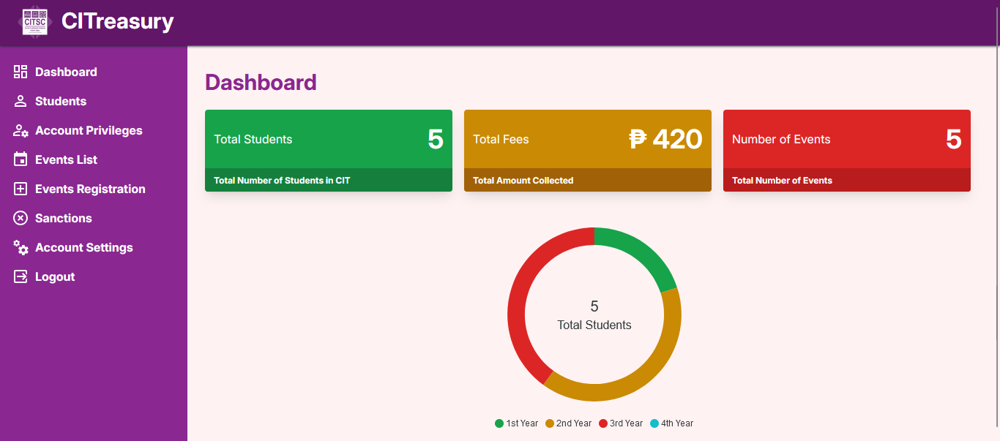
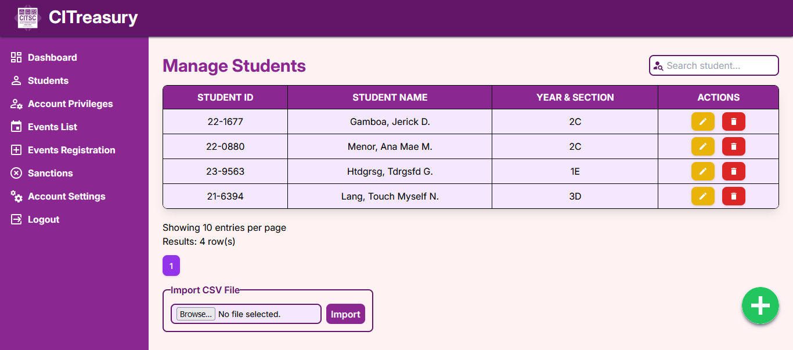

# CITreasury
A Student Fee Collection System that uses MYSQL as database, written in PHP

## Screenshots:

## How to use?
1. Clone this repository to hosting directory (e.g.. htdocs folder in XAMPP)
2. Start the web server
3. Open web browser then go to this URL: http://localhost/CITreasury-main/initialize.php
4. This will initialize the database, insert sample data, and show relevant information about the admin account